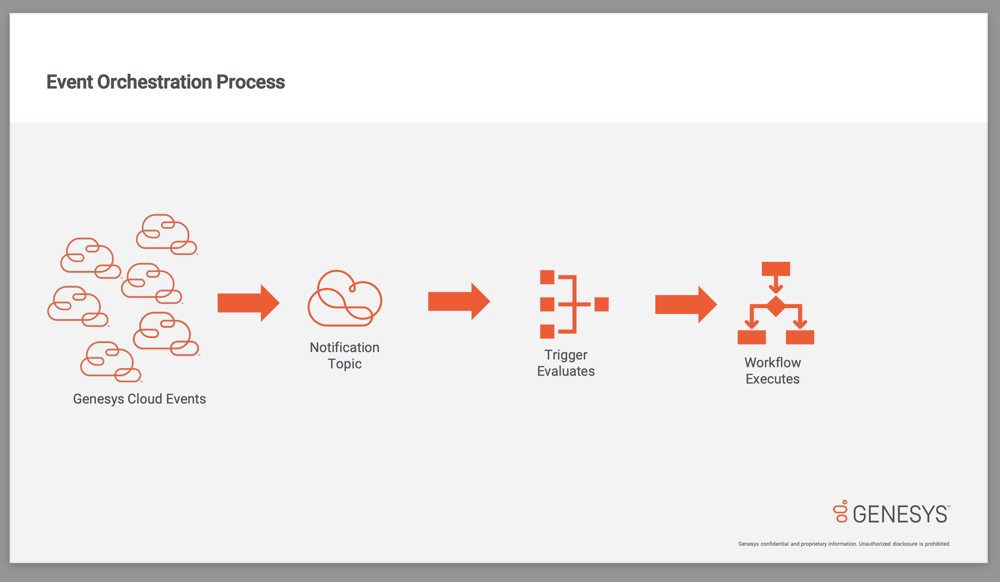

This Genesys Cloud Developer Blueprint provides a simple example of how to deploy an event orchesration infrastructure using Terraform, CX as Code, and Archy.

This blueprint demonstrates how to:

- Deploy a simple event orchestration infrastructure using Terraform
- Setup a process automation trigger



## Contents

- [Solution components](#solution-components "Goes to the Solutions components section")
- [Prerequisites](#prerequisites "Goes to the Prerequisites section")
- [Implementation steps](#implementation-steps "Goes to the Implementation steps section")
- [Additional resources](#additional-resources "Goes to the Additional resources section")

## Solution components

- **[Genesys Cloud](https://www.genesys.com/genesys-cloud "Opens the Genesys Cloud website")** - A suite of Genesys cloud services for enterprise-grade communications, collaboration, and contact center management. You create and manage OAuth clients in Genesys Cloud.
- **[Archy](https://developer.genesys.cloud/devapps/archy/ "Opens the Archy website")** - A Genesys Cloud Architect YAML processor that lets you create Architect flows from YAML files that you write.
- **[Terraform](https://www.terraform.io/ "Opens the Terraform website")** - An open-source infrastructure as code software tool that provides a consistent CLI workflow to manage hundreds of cloud services
- **[CX as Code ](https://developer.genesys.cloud/api/rest/CX-as-Code/ "Opens the CX as code website")** - A Genesys Cloud Terraform provider that provides a command line interface for declaring core Genesys Cloud objects.
- **[AWS Lambda](https://aws.amazon.com/lambda/ "Opens the AWS Lambda website")** - A serverless computing service for running code without creating or maintaining the underlying infrastructure.
- **[AWS S3](https://aws.amazon.com/s3/ "Opens the AWS S3 website")** - An object storage service offering industry-leading scalability, data availability, security, and performance.
- **[Python](https://www.python.org/ "Opens the NodeJs website")** - An interpreted, high-level programming language that is used to quickly build modularized, object-oriented programs.
- **[Golang](https://go.dev/ "Opens golang website")** - syntactically similar to C, Go is a statically typed, compiled programming language designed at Google.

## Prerequisites

### Specialized knowledge

- Administrator-level knowledge of Genesys Cloud
- AWS Cloud Practitioner-level knowledge of AWS IAM, Amazon Comprehend, Amazon API Gateway, AWS Lambda, AWS SDK for JavaScript, and the AWS CLI (Command Line Interface)
- Experience with Terraform

### Genesys Cloud account requirements

- A Genesys Cloud license. For more information, see [Genesys Cloud Pricing](https://www.genesys.com/pricing "Opens the Genesys Cloud pricing page") in the Genesys website.
- Master Admin role. For more information, see [Roles and permissions overview](https://help.mypurecloud.com/?p=24360 "Opens the Roles and permissions overview article") in the Genesys Cloud Resource Center.
- Archy. For more information, see [Welcome to Archy](/devapps/archy/ "Goes to the Welcome to Archy page").
- CX as Code. For more information, see [CX as Code](https://developer.genesys.cloud/api/rest/CX-as-Code/ "Opens the CX as Code page").

### AWS user account

- An administrator account with permissions to access the following services:
  - AWS Identity and Access Management (IAM)
  - AWS Lambda
  - AWS S3
- AWS credentials. For more information about setting up your AWS credentials on your local machine, see [About credential providers](https://docs.aws.amazon.com/sdkref/latest/guide/creds-config-files.html "Opens The shared config and credentials files") in AWS documentation.

### Third-party software

- Terraform. For more information, see [Download Terraform](https://www.terraform.io/downloads) on the Terraform website.

- Python version 3.8.10 or later. For more information, see [Download Python](https://www.python.org/downloads/) on the Python website.

- Golang version go1.16 or later. For more information, see [Download Go](https://go.dev/dl/) on the Python website.

## Implementation steps

- [Clone the repository that contains the project files](#clone-the-repository-that-contains-the-project-files "Goes to the Clone the repository containing the project files section")
- [Create a role for administering Process Automation Triggers](#create-a-role-for-administering-process-automation-triggers "Goes to the Create a role for administering Process Automation Triggers section")
- [Create an OAuth Client Credentials Token in Genesys Cloud](#create-an-oauth-client-credentials-token-in-genesys-cloud "Create an OAuth Client Credentials Token in Genesys Cloud section")
- [Define the environment variables](#define-the-environment-variables "Define the environment variables section")
- [Deploy the infrastructure](#deploy-the-application "Goes to the Build and deploy the infrastructure section")
- [Building Golang Lambda](#building-golang-lambda "Goes to the building golang lambda section")

### Clone the repository that contains the project files

Clone the [deploy-sample-eventOrchestration-setup-blueprint](https://github.com/EbenOsei21/deploy-sample-eventOrchestration-setup-blueprint "Opens the deploy-sample-eventOrchestration-setup-blueprint") repository from GitHub to your local environment.

### Create a role for administering Process Automation Triggers

In Genesys Cloud, create a role that includes the `processautomation > trigger > All Permissions` permission. Assign this role to yourself so you can assign it to a client in the next step.

### Create an OAuth Client Credentials Token in Genesys Cloud

1. Create an OAuth client with the following settings:

- **Grant type**: Client Credentials
- **Role**: Configure it to use the role created in the previous step

2. Note the client ID and client secrect, you will use this in the next step.

For more information, see [Create an OAuth client](https://help.mypurecloud.com/?p=188023 "Goes to the Create an OAuth client article") in the Genesys Cloud Resource Center.

### Define the environment variables

- **GENESYSCLOUD_OAUTHCLIENT_ID**: This is the Genesys Cloud client credential grant Id that CX as Code executes against. The client Id from the previous step goes here.
- **GENESYSCLOUD_OAUTHCLIENT_SECRET**: This is the Genesys Cloud client credential secret that CX as Code executes against. The client secret from the previous step goes here.
- **GENESYSCLOUD_REGION**: This is the Genesys Cloud region in which your organization is located. i.e us-east-1
- **GENESYSCLOUD_ENVIRONMENT**: This is where your organization is hosted i.e mypurecloud.com
- **AWS_ACCESS_KEY_ID**: This is the id that identifies your AWS account
- **AWS_SECRET_ACCESS_KEY**: This is the AWS secret that authorizes executions.

### Define Terraform variables

- In the `terraform` directory, open the `variables.auto.tfvars`

- Edit the variables to match your prefered configuration and save your changes. Make sure your s3 bucket name is [valid](https://docs.aws.amazon.com/AmazonS3/latest/userguide/bucketnamingrules.html)

- Take note of the `aws_region` as well becuase the value should match your region.

### Deploy the infrastructure

Open a terminal window and set the working directory to the `terraform` directory in the cloned repo. Then run the following:

```bash
terraform init
terraform apply --auto-approve
```

This should create and deploy the infrastructure. This includes 3 flows(an inbound call flow, a secure flow and a worflow), two lambdas(including the roles and policies that comes with it), data integrations, and data actions for the lambdas. After everything is set up, a python script, located in `blueprint/terraform/workflow_trigger` get called with the id of the workflow. This is a crucial part of the infrastructure because the script subscribes(with your `workflowId`) to a Notifaction topic that allows the workflow to be called when a call disconnects in your system.

### Building Golang Lambda

This blueprint comes with prebuilt go lambdas. If you decide to make any changes to the lambda code or even replace the whole thing, the code has to be built before deploying. The command to build golang lambda for AWS is `GOOS=linux GOARCH=amd64 go build -o <binary-destination>`. For example, if you make changes to `blueprint/lambda-paymentIdGenerator/cmd/main.go`, you have to open the terminal and set the working directory to `blueprint/lambda-paymentIdGenerator/cmd` and run the following command:

```bash
GOOS=linux GOARCH=amd64 go build -o ../bin/main
```

## Additional resources

- [Genesys Cloud Provider](https://registry.terraform.io/providers/MyPureCloud/genesyscloud/latest/docs) on Terraform website.
- [AWS Provider Documentation](https://registry.terraform.io/providers/hashicorp/aws/latest/docs) on Terraform.
- [Deploy a simple IVR using Terraform, CX as Code, and Archy](/blueprints/simple-ivr-deploy-with-cx-as-code-blueprint/ "Goes Deploy a simple IVR using Terraform, CX as Code, and Archy blueprint") in the Genesys Cloud Developer Center.
- [deploy-sample-eventOrchestration-setup-blueprint](https://github.com/EbenOsei21/deploy-sample-eventOrchestration-setup-blueprint) in Github,
